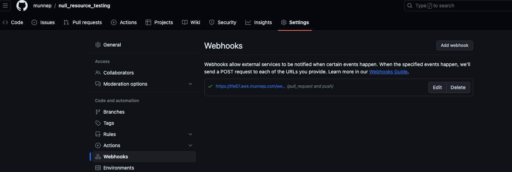

# Create 500 workspaces

With this repository the idea is to create 500 workspaces connected to a VCS repository. Make changes to this repository you have and see the changes in runs. 

- We will create the 500 workspaces with a VCS connection
- We make some changes on another workspaces and see this executed within TFE

# Prerequisites

- Have another repository ready with some resources that you can change. Example [https://github.com/munnep/null_resource_testing](https://github.com/munnep/null_resource_testing)
- Have a VCS connection created to Github for example [https://developer.hashicorp.com/terraform/cloud-docs/vcs/github-app](https://developer.hashicorp.com/terraform/cloud-docs/vcs/github-app)


## Install terraform  
See the following documentation [How to install Terraform](https://learn.hashicorp.com/tutorials/terraform/install-cli)

# How to

- Clone the repository to your local machine
```
git clone https://github.com/munnep/create_500_workspaces_with_vcs_connection.git
```
- Go to the directory
```
cd create_500_workspaces_with_vcs_connection
```
- create a file called `variables.auto.tfvars` with the following contents and your own values
```
oauth_token_id       = "ot-KsyvdYTLfRapSk5h"          # vcs authentication token
repository           = "munnep/null_resource_testing" # repository they should all be connected to
token                = "snfjkdsnkdfjksdf"             # tfe token
hostname             = "tfe67.aws.munnep.com"         # hostname of your TFE environment
number_of_workspaces = 200                            # number of workspaces to create
```
- Start by creating 200 workspaces first. If you do 500 at once you might hit the API limit of github
```
terraform init
```
- terraform apply
```
terraform apply
```
- You should see only a single webhook being created  
  
- Update this to 400 to create the remaining workspaces. Alter the variables in the file `variables.auto.tfvars`
```
number_of_workspaces = 400                            # number of workspaces to create
```
- terraform apply
```
terraform apply
```
- Update this to 500 to create the remaining workspaces. Alter the variables in the file `variables.auto.tfvars`
```
number_of_workspaces = 500                            # number of workspaces to create
```
- terraform apply
```
terraform apply
```
- Once everything is create you can verify the workspaces if they all did a first run by starting the script `overview_workspace_runs.sh` which generates a file called output.txt. Please alter the following at the top of this script
```sh
# TOKEN=<your API token>       # or set it on the commandline using export TOKEN=
TFE_HOST=tfe67.aws.munnep.com  # Change this to your TFE environment FQDN
ORG_NAME=test                  # Organization name 
OUTPUT_FILE=output.txt         # name of the file to output the data
PAGE_SIZE=100                  # number of items per page (default is 20, max is 100)
WORKSPACES=""                  #var to store workspace ids
```
run
```sh
./overview_workspace_runs.sh
```
output
```
--- OVERVIEW WORKSPACES on test and RUNS by date ----
WORKSPACE_NAME=tomato_409
    RUN DATE: 2023-10-20T14:18:19.171Z - RUN NAME: Merge pull request #6 from munnep/test test6_final
WORKSPACE_NAME=tomato_304
    RUN DATE: 2023-10-20T14:20:53.603Z - RUN NAME: Merge pull request #6 from munnep/test test6_final
```
- On the repository your workspaces are linked to create a new branch
- Make a change on your code that would trigger a change on your repository. Example add a `null_resource` to your code
- Create a new pull request to merge this to the `main`branche
- You should see that if will trigger 500 speculative plans and this takes a lot of time. Be patient. Also the number 500 might not be visible right away
- After this you confirm and merge it into the main to trigger the actual runs
- Once everything is created you can verify the workspaces if they all did a first run and a second run by starting the `overview_workspace_runs.sh` again.
run 
```sh
./overview_workspace_runs.sh
```
output example:
```
--- OVERVIEW WORKSPACES on test and RUNS by date ----
WORKSPACE_NAME=tomato_409
    RUN DATE: 2023-10-20T14:40:19.171Z - RUN NAME: Merge pull request #6 from munnep/test test8
    RUN DATE: 2023-10-20T14:18:19.171Z - RUN NAME: Merge pull request #6 from munnep/test test6_final
WORKSPACE_NAME=tomato_304
    RUN DATE: 2023-10-20T14:40:19.171Z - RUN NAME: Merge pull request #6 from munnep/test test8
    RUN DATE: 2023-10-20T14:20:53.603Z - RUN NAME: Merge pull request #6 from munnep/test test6_final
```


# TODO

# Done


